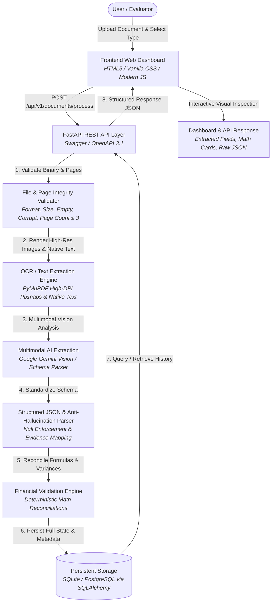

# System Architecture Documentation

## Intelligent Document Extraction, Validation & API Platform

This document describes the high-level architecture, component breakdown, data flow, and error-handling pipeline of the platform.

---

## 1. End-to-End Pipeline Workflow

---

## 2. Component Details

### 2.1 Frontend Dashboard (`frontend/`)
- **Responsive UI**: Glassmorphic, dark-mode design system with responsive flex/grid layouts.
- **Dynamic Ingestion**: Drag & drop zone supporting PDF, JPG, and PNG files with size and page count inspection.
- **Interactive Inspector**:
  - Financial Validation cards with operand chips, calculated vs reported values, and variance calculation.
  - Key-value field grid showing confidence meters, evidence source snippets, and page references.
  - Line items & comparative financial periods table.
  - Interactive Raw JSON viewer with one-click copy.
- **Persistence History**: Real-time listing of all processed documents with status filters and quick-inspection lookups.

### 2.2 FastAPI Backend API Layer (`backend/app/api/`)
- **GET `/api/v1/health`**: Real-time system health, database connectivity, and active subsystem checks.
- **POST `/api/v1/documents/process`**: Core multipart upload handler orchestrating validation, extraction, calculation, and database persistence.
- **GET `/api/v1/documents`**: Paginated retrieval of all stored documents with summary metrics.
- **GET `/api/v1/documents/{document_name}`**: Full document lookup by name or ID.
- **Swagger Documentation**: Live interactive OpenAPI docs at `/docs` and `/openapi.json`.

### 2.3 File Validation Service (`backend/app/services/file_validator.py`)
- **Allowed Formats**: `.pdf`, `.jpg`, `.jpeg`, `.png`.
- **Zero-Byte & Empty Check**: Rejects empty files.
- **Corrupted File Detection**: Verifies binary headers and parses integrity via PyMuPDF/PIL before processing.
- **Page Limit Enforcement**: Strict check ensuring `page_count <= 3` (rejects 4+ pages with descriptive 400 error).
- **SHA-256 Hashing**: Generates unique file hash for deduplication and provenance.

### 2.4 Multimodal OCR & AI Extraction Engine (`backend/app/services/`)
- **PyMuPDF Engine**: Converts PDF pages into 200+ DPI images for multimodal vision while extracting any native embedded text.
- **Multimodal AI**: Leverages Google Gemini Vision (`gemini-2.5-flash` / `gemini-1.5-flash`) with structured JSON schema enforcement.
- **Anti-Hallucination Guardrails**: Unreadable or absent values are strictly populated as `null` with `is_missing: true`. No synthetic values are invented.
- **Evidence Traceability**: Retains original source text snippets and exact page numbers for every extracted field.

### 2.5 Financial Validation Engine (`backend/app/services/financial_validator.py`)
Deterministic calculations executed with tolerance handling (`±0.05`):
1. **Invoice**:
   - $\text{Line Total} \approx \text{Quantity} \times \text{Unit Price}$
   - $\text{Subtotal/Total} \approx \sum \text{Line Totals}$
   - $\text{Total Amount} \approx \text{Taxable Amount} + \text{Total Tax}$
   - $\text{Change Due} \approx \text{Cash Paid} - \text{Total Amount}$
2. **Balance Sheet**:
   - $\text{Total Capital \& Liabilities} \approx \text{Total Assets}$ (evaluated per period)
   - Component totals: $\text{Current Assets} + \text{Non-Current Assets} \approx \text{Total Assets}$
3. **Profit & Loss**:
   - $\text{Total Income} \approx \text{Interest Earned} + \text{Other Income}$
   - $\text{Total Expenditure} \approx \text{Interest Expended} + \text{Operating Expenses} + \text{Provisions}$
   - $\text{Net Profit (Pre-Minority)} \approx \text{Total Income} - \text{Total Expenditure}$
   - $\text{Net Profit (Group)} \approx \text{Net Profit (Pre-Minority)} - \text{Minority Interest}$
4. **Cash Flow Statement**:
   - $\text{Net Increase in Cash} \approx \text{Operating Cash} + \text{Investing Cash} + \text{Financing Cash} + \text{FX Adjustments}$
   - $\text{Closing Cash} \approx \text{Opening Cash} + \text{Net Increase in Cash} + \text{Adjustments}$
   - Negative values formatted in parentheses e.g. `(50,000)` are parsed as `-50000.0`.

### 2.6 Persistence Layer (`backend/app/db/`)
- Relational database schema with SQLAlchemy ORM.
- Defaults to persistent SQLite database (`documents.db`) or PostgreSQL in production via `DATABASE_URL`.
- Complete JSON archiving of extracted data, validation results, and execution metadata.
